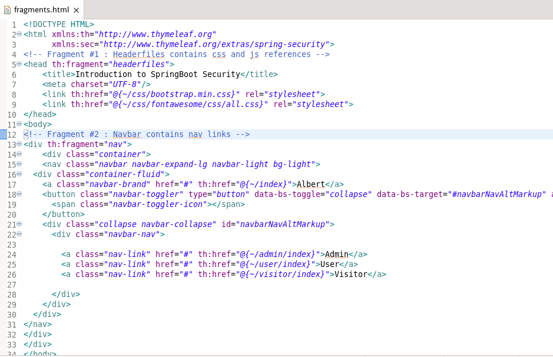

# spring-boot-security

In this tutorial, We will create a spring boot security example.

<h1>Steps for creating project.</h1>

 Go to File -> Spring starter project

the project will be see below screen

<h3>dependencies</h3>
<ul>
 <li>Spring web.</li>
 <li>Spring Security.</li>
 <li>Thymeleaf.<li>
</ul>
<h3>Create controllers</h3>

Create a package named "com.boot.alberto.controllers"

Create next java class inside controller package.

<ul>
    <li>AdminController</li>
    <li>HomeController</li>
    <li>UserController</li>
    <li>VisitorController</li>
</ul>
<h3>AdminController.java</h3>

<pre>
    <code>
package com.boot.alberto.controllers;
import org.springframework.stereotype.Controller;
import org.springframework.web.bind.annotation.GetMapping;
import org.springframework.web.bind.annotation.RequestMapping;

@Controller
@RequestMapping("admin")
public class AdminController {
	 @GetMapping("index")
	 		public String index(){return "admin/index";
	    }
}
    </code>
</pre>

<h3>HomeController.java</h3>

<pre>
    <code>
package com.boot.alberto.controllers;
import org.springframework.stereotype.Controller;
import org.springframework.web.bind.annotation.RequestMapping;
import org.springframework.web.bind.annotation.GetMapping;

@Controller
@RequestMapping("/")
public class HomeController {
	@GetMapping("index")
	public  String index() {
		return "index";
	}	
}
    </code>
</pre>

<h3>UserController.java</h3>

<pre>
    <code>
package com.boot.alberto.controllers;
import org.springframework.stereotype.Controller;
import org.springframework.web.bind.annotation.GetMapping;
import org.springframework.web.bind.annotation.RequestMapping;

@Controller
@RequestMapping("user")
public class UserController {
	@GetMapping("index")
    public String index(){
        return "user/index";
    }
}
    </code>
</pre>

<h3>VisitorController.java</h3>

<pre>
    <code>
package com.boot.alberto.controllers;
import org.springframework.stereotype.Controller;
import org.springframework.web.bind.annotation.GetMapping;
import org.springframework.web.bind.annotation.RequestMapping;

@Controller
@RequestMapping("visitor")
public class VisitorController {	
	@GetMapping("index")
    public String index(){
        return "visitor/index";
    }
}
    </code>
</pre>

<h2>create files html</h2>

<h3>/template/index.html</h3>

<h3>/template/admin/index.html</h3>

<h3>/template/user/index.html</h3>

<h3>/template/visitor/index.html</h3>

<h3>/template/fragments.html</h3>

<h2>http basic authentication using spring security</h2>

Create a package named "package com.boot.alberto.security"

Create a java class named "WebSecurityConfigurerAdapter" 

<pre>
    <code>
package com.boot.alberto.security;

import org.springframework.context.annotation.Bean;
import org.springframework.context.annotation.Configuration;
import org.springframework.security.config.annotation.authentication.builders.AuthenticationManagerBuilder;
import org.springframework.security.config.annotation.web.builders.HttpSecurity;
import org.springframework.security.config.annotation.web.configuration.EnableWebSecurity;
import org.springframework.security.config.annotation.web.configuration.WebSecurityConfigurerAdapter;
import org.springframework.security.crypto.bcrypt.BCryptPasswordEncoder;
import org.springframework.security.crypto.password.PasswordEncoder;

@Configuration
@EnableWebSecurity
public class SecurityConfiguration extends WebSecurityConfigurerAdapter {
	
	
	@Override
	protected void configure(AuthenticationManagerBuilder auth) throws Exception {
		auth
				.inMemoryAuthentication()
				.withUser("admin").password(passwordEncoder().encode("123456")).roles("ADMIN")
				.and()
				.withUser("user").password(passwordEncoder().encode("123456")).roles("USER")
				.and()
				.withUser("visitor").password(passwordEncoder().encode("123456")).roles("VISITOR");			
				
	}
  @Override
protected void configure(HttpSecurity http) throws Exception {
	http
			.authorizeRequests()
			
			.antMatchers("/index.html").permitAll()
			.antMatchers("/visitor/**").authenticated()
			.antMatchers("/admin/**").hasRole("ADMIN")
			.antMatchers("/user/**").hasAnyRole("ADMIN", "USER")
			.and()
			.httpBasic();
	
	  
}	
  @Bean
  PasswordEncoder passwordEncoder() {
	  return new BCryptPasswordEncoder();
	                                                                                                                                                     
  }

}

    </code>
</pre>

